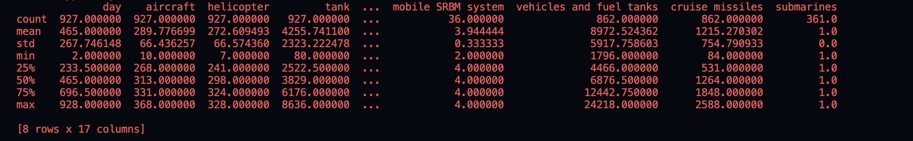
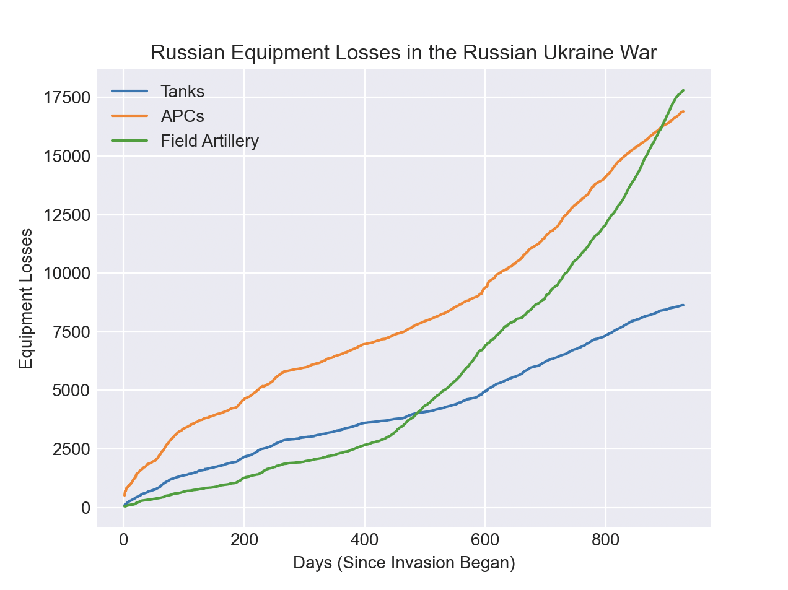

# IDS706_Fennie_Report
## Fennie's Pandas Descriptive Statistics Report
### Python script reads a dataset, generates descriptive statistics, and a visualization using Pandas

Pandas Decriptive Report for Russian Equipment Losses (since the start of the war)\
Data Source - Kaggle: Russia Ukraine War 2022\
URL: https://www.kaggle.com/datasets/piterfm/2022-ukraine-russian-war?select=russia_losses_equipment.csv

Core Files are:
- .devcontainer
- Makefile
- CI/CD pipeline
- requirements.txt
- README.md
- library.py

### Summary Statistics of the Russian Equipment Losses

### Data Visualization of the Russian Equipment Losses
